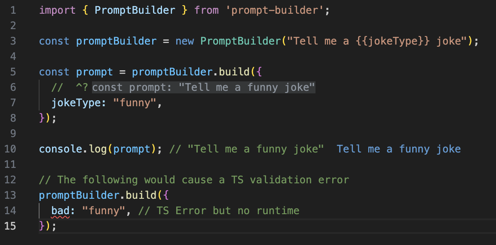

# Prompt

The `Prompt` class is responsible for replacing template placeholders with supplied arguments.



<figure><figcaption><p><a href="https://www.typescriptlang.org/play?#code/JYWwDg9gTgLgBAbzgBShc8C+cBmaRwDkY+YMAtAEYCuwANgCYCmUhA3AFBcDGEAdgGd4JdGTgBeOHyYB3FKRgAKAEQAVJnTpwQTOAENECAFYQA1k1UBPME0zYT55QBpEHOO48B6T3AB6Afjc4BwtrJgAuOGUcaj4+S2cOTABKADoYCABlGChgPgBzRWTODl5BCDomVLoIQpEMYrggA">TS Playground</a></p></figcaption></figure>




```typescript
import { Prompt } from 'prompt-builder';

const prompt = new Prompt("Tell me a {{jokeType}} joke", {
      // ^? const prompt: "Tell me a funny joke"
  jokeType: "funny",
}).toString();

console.log(prompt);   // "Tell me a funny joke"
```



