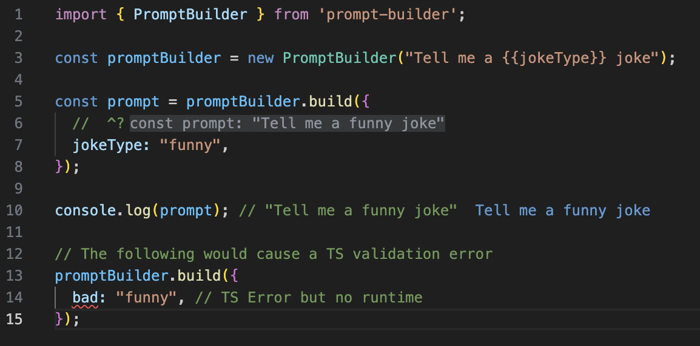

# PromptBuilder

`PromptBuilder`

The `PromptBuilder` class allows you to define your template and then `build()` your prompt using the supplied data. Note that the result of the `build()` function is still a string literal, meaning you can later write a function that expects certain string literals, making it easy to split out which prompts can go to what providers at a type level.


### Basic Usage


Note Args passed into `build` must be constant


### Input Validation

The Prompt Builder also supports input validation using basic TypeScript types and Zod schemas.

#### TypeScript Validation



In the above example, we're defining the `jokeType` argument to be either "funny" or "silly". Any other value will result in a TypeScript error.

#### Zod Validation



<figure><figcaption><p><a href="https://tsplay.dev/mZvRKm">TS Playground Example</a></p></figcaption></figure>







```ts
import { z } from 'zod';
import { PromptBuilder } from 'prompt-builder';

const promptBuilder = new PromptBuilder("Tell me a {{jokeType}} joke");

// Define a Zod schema for inputs
const validatedPromptBuilder = promptBuilder.addZodInputValidation(z.object({
  jokeType: z.union([z.literal("funny"), z.literal("silly")]),
}));

const prompt = validatedPromptBuilder.build({
  jokeType: "funny",
});

console.log(prompt); // "Tell me a funny joke"

// The following would cause a Zod validation error
validatedPromptBuilder.build({
  jokeType: "bad", // Zod validation error here!
});
```



In the above example, we're defining a Zod schema for our input. This gives us more flexibility and power in terms of validation rules and error handling.

#### Validate - TS helper

If zod validation is added to a PromptBuilder then you can use the `validate` type predicate to scope down your types in the event a prompt builder requires a type more narrow than is currently defined.&#x20;



<figure><figcaption><p><a href="https://www.typescriptlang.org/play?#code/JYWwDg9gTgLgBAbzgLzgXzgMyhEcDkyEAJvgNwBQoksicACjuDAEICuwANsQKZTpYmBMEzAwAtACMO3PuQoUAxhAB2AZ3gjcY9l178AvHBU8A7g1GsZ+gBQAiACo9OnOCB5wAhogQArCADWPA4AnmA8aBj+QXYAlAB0nsTEAFokAJIqYGwwAGqenMDEnjDAqjbI8RCSvjyKMDYIFHBw0cFhPABcKPFsKmUqNgDalYUwfAX2mH0qIXEAND1jE5z2alycc7EAurHzFGixsZRKqhpeUADmanBGTS1toeHddtMqs3b7aCfAmHA2WmYulkUHiADcCkUSjwbJ4rmojohmnBlOpNJZbnBATprHx4tI9LD4cdkai1BBODx4pwIJcAZYSWggA">TS Playground Example</a></p></figcaption></figure>




```typescript
import { z } from 'zod';
import { PromptBuilder } from 'prompt-builder';

const promptBuilder = new PromptBuilder("Tell me a {{jokeType}} joke").addZodInputValidation(z.object({
  jokeType: z.union([z.literal("funny"), z.literal("silly")]),
}));

const args = {
  jokeType: "funny",
};

if (promptBuilder.validate(args)) {
  const prompt = promptBuilder.build(args);
  console.log(prompt);
}

```



